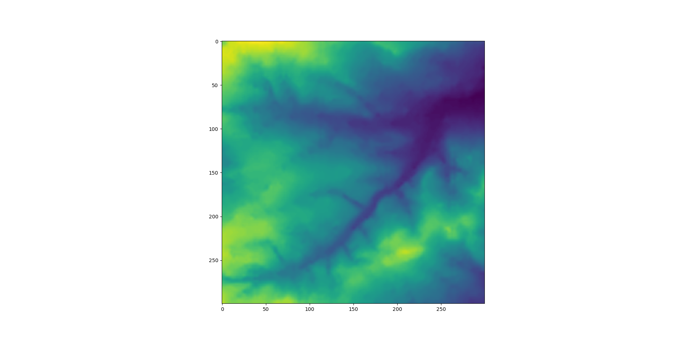

The purpose of this page is to showcase and describe the agent-based model for Assignment 1 of GEOG5990M Programming for Geographical Information Analysis: Core Skills.

## Description

This model simulates the movements and interactions of sheep with their environment and each other. For technical, installation, and running information please see the [README](https://github.com/simagyari/GEOG5990M/blob/main/README.md) file and the [documentation](https://github.com/simagyari/GEOG5990M/blob/main/docs) of the [project reposity](https://github.com/simagyari/GEOG5990M). The latter one must be downloaded to serve from localhost.

The model features sheep grazing an environment by decreasing values of the raster file they are moving on.



The number of agents is variable, with the starting coordinates of the first 100 sourced from the web. The other sheep coordinates are randomly generated. The iterations of the model are manually adjustable (see Development and Issues), as well as a neighbourhood value to decide which other agents are counted as neighbours each turn. Sheep move, eat, and share food with each other, as well as be sick when their food storage exceeds 100 units. Once the model run has finished, output is registered in text files to make the different simulations comparable.


The model can be initiated from the command line or terminal, and manifests a pop-up window where the run can be started. The number of agents, iterations, and the neighbourhood distance can be set in the command line when initialising the model with the following code:  
```
python model.py --agents [] --iterations [] --neighbourhood []
```
where the square brackets represent the integers required as the parameters. If no values are set, the defaults of 10, 100, and 20 are used. More information is available in the [README](https://github.com/simagyari/GEOG5990M/blob/main/README.md).

## Development and Issues

The development of the model is following the guidelines of the practical material from Assignment 1, GEOG5990M at the University of Leeds. The code was developed between 24/01/2022 and 06/04/2022 using [Python](https://www.python.org/) 3.9.7 through the [Anaconda](https://www.anaconda.com/) distribution. The editor used was [Microsoft Visual Studio Code](https://code.visualstudio.com/) version 1.66.0 instead of the recommended [Spyder](https://www.spyder-ide.org/), since the code was made for command-line execution. VSCode provided a better environment for building the model outside of the iPython kernel, which requires different usage of [matplotlib](https://matplotlib.org/) backends and visualisation.

The main issues arising throughout the development phase were:
1. Movement of agents - to make the two-dimensional random-generated movement fair, the random range had to be divided into three parts, increasing, decrreasing, and not changing the coordinate. This way the agents are able to move in all eight direction from a cell, as well as to stay in place.
2. Speed regulation of agents - to regulate the speed of agents based on the fullness of their storage, the original idea was to create different speeds for each fullness and subsequently round them to the nearest integer to enable actual movement in the nested list of environment. However, due to time and complexity issues, the final product features a step change from 1 pixel to 2 when the storage is at least half full.
3. Iterations of the model - iterations could have been regulated through a generator function appended to the animation of matplotlib, but I deemed the manual control of the number of model runs more important than the seamless and random nature of a generator function, as there were no important events in the agent movement that could have signed the end of the simulation. Thus, the number of iterations has to be set manually, facilitating the modelling of specific time periods.

## Testing

The model was tested using the [unittest](https://docs.python.org/3/library/unittest.html) framework. For more details of the testing carried out on the project, please see [Testing](abm_testing.html).

## Profiling

The model was profiled for runtime (speed) using [cProfile](https://docs.python.org/3/library/profile.html). Memory usage was profiled with [memory-profiler](https://pypi.org/project/memory-profiler/). For details of the runtime and memory profiling carried out on the project, please see [Profiling](abm_profiling.html).
