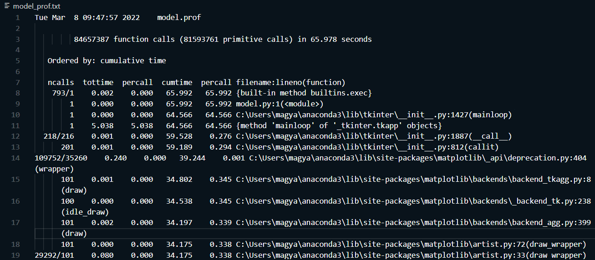
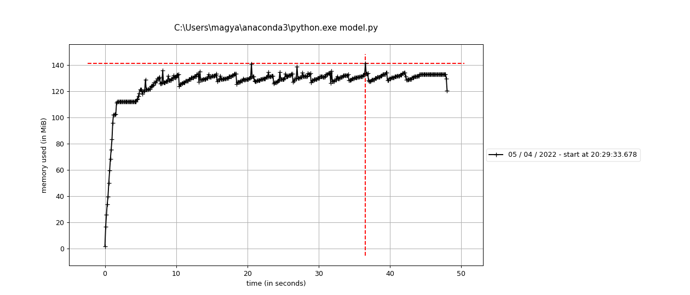

This page outlines the runtime and memory profiling carried out on the agent-based model.

## Runtime profiling
[cProfile](https://docs.python.org/3/library/profile.html) has been used to profile the code for speed. It enables observing the time the model spent in each method, function, or loop, as well as the times these were called. The output is registered in a .prof text file. Profiling data showed that the code spends approximately 60 seconds in the main tkinter loop, with most of the time taken up by the animation itself. Raster and web scraping methods were accelerated with the use of [list comprehensions](https://www.w3schools.com/python/python_lists_comprehension.asp), enabling faster reading and processing times for environment values and agent coordinates.



## Memory profiling

Memory profiling has been conducted by the [memory-profiler](https://pypi.org/project/memory-profiler/) package of Python. This command-line based package giver options to profile single functions with the @profile decorator, as well as a full file with the ```mprof run <file> <arguments>``` command. Plots can be generated from the latest run with the command ```mprof plot``` to complement the output text files. Profiling was carried out with the default 10, 100, and 20 values of agents, iterations, and negihbourhood, respectively. It was found that the code needs about 150 MiB RAM to run for the full model.py.


