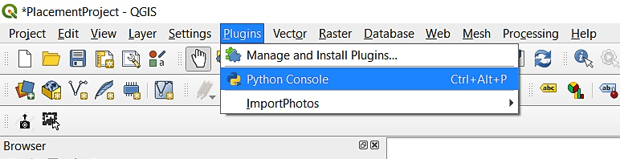
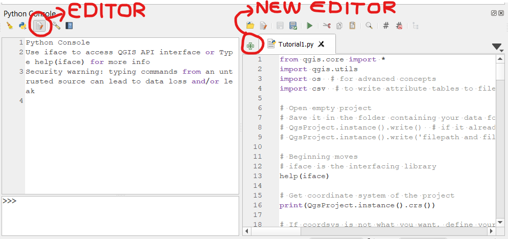
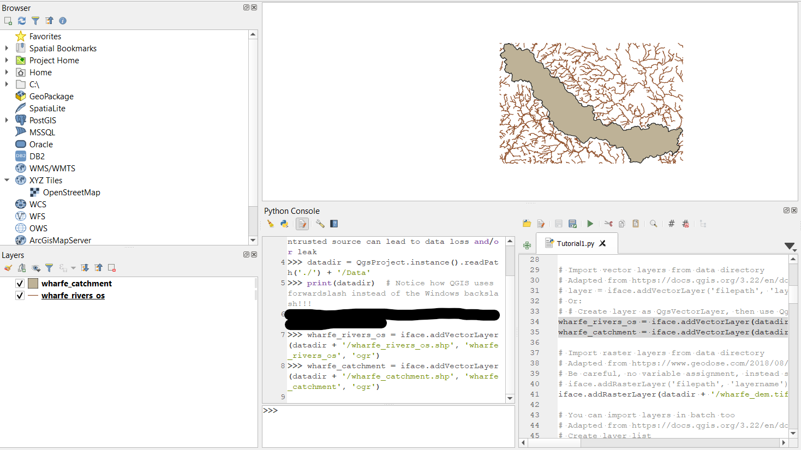
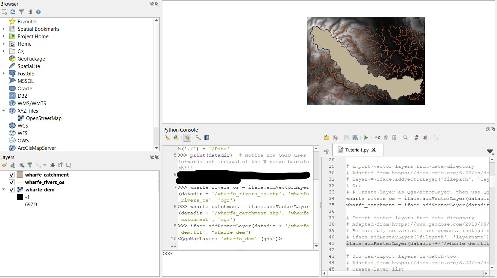

# Introduction
This tutorial has been made as an output of my 70-hour placement project for GEOG5230M Professional Development at MSc River Basin Dynamics and Management with GIS at the University of Leeds. The aim of this project is to showcase a possible solution for creating an e-learning tool to teach Python in QGIS to students in water-related fields.

To complete these tutorials, a basic understanding of Python, its data structures, functions, and classes is required, as well as some familiarity with the desktop usage of QGIS3. To follow the tutorial, an installation of QGIS 3.10 A Coruna Long Term Release is required. The code has not been tested and adapted to other versions of QGIS, although it might work with them.

This is the first tutorial, talking about accessing Python functionality and basic layer manipulation inside the QGIS Python Console.

# Table of Contents
- [Introduction](#introduction)
- [Opening the PyQGIS Console](#opening-the-pyqgis-console)
- [iface](#iface)
- [Project instance](#project-instance)
	* [Save project](#save-project)
- [Load layers](#load-layers)
	* [Load vector layer](#load-vector-layer)
	* [Load raster layer](#load-raster-layer)
- [Working with layers](#working-with-layers)
	* [Edit vector layer](#edit-vector-layer)
		* [Set active layer](#set-active-layer)
		* [Get features](#get-features)
		* [Editing attributes](#editing-attributes)
		* [Vector geometry](#vector-geometry)
		* [Field calculation](#field-calculation)
		* [Write vector file](#write-vector-file)
	* [Explore raster statistics](#explore-raster-statistics)
		* [Extent and resolution](#extent-and-resolution)
		* [Descriptive statistics](#descriptive-statistics)
		* [Write raster file](#write-raster-file)


# Opening the PyQGIS Console
**TASK: Open an empty QGIS project and save it at your preferred location. In your project folder, create a subfolder called "Data".**

In your project file (.qgz) navigate to the `Plugins > Python Console` option, which pops up the Python Console on the screen. Inside the Python Console, click the `Show Editor` button to show the editor.



*In the Console, you can run Python commands, while in the Editor, you can create .py files to save those commands or a combination of them. It works like a generic text editor and terminal combination you can find in any IDE. You can pop up the Console using the keyboard shortcut `Ctrl+Alt+P` too.*

When you open the Console and Editor, there is a block of code automatically run:

```
from qgis.core import *
import qgis.utils
```
This accesses the basic functionality of Python in QGIS. You will always need this, and it will always go ahead. Additionally, you can import and install other libraries like in general Python.

**TASK: in the Editor, create a new .py file in the folder of your QGIS project. Name it Tutorial1.py.**

The file will open in the Editor. The Editor's toolbar has options on running the complete code, or running the selected lines. We will use the latter frequently, as previous commands do not need reiterating to do another one in our case. When you have selected the lines you want to run, use your right mouse button and click `Run Selected Lines` for the lines to get copied into the Console. If they do not run automatically, which usually happens with multiple lines chosen, go to the Console and hit `ENTER` to run them.



**TASK: write all your code in the Editor to have them saved if you close your project.**

*Console inputs and outputs are lost once you close the QGIS project.*

# iface
The `iface` package manages the QGIS interface, containing many useful features.

**TASK: type `help(iface)` into the Console to obtain the documentation of iface.**

# Project instance
`QgsProject.instance()` is the way to refer to the current project file. You can manipulate it with different methods of this object, such as `load()` or `write()`.

**TASK: read the folder of the project and add your data folder name to create your data directory variable.**
```
datadir = QgsProject.instance().readPath('./') + '/Data'
print(datadir)
```
*The above code reads the containing directory of the project file, then appends /Data to it.*

**TASK: get the projection of your project map, then set it to British National Grid.**
```
print(QgsProject.instance().crs())
QgsProject.instance().setCrs('EPSG:27700')
```
*EPSG:27700 is the code of the British National Grid. EPSG:4326 is that of the WGS84 ellipsoid*

## Save project
You can save your project with the command `QgsProject.instance().write(<PATH>)` from the Console if it has not been saved yet or you want to do another save to a different place. If you would like to save an already placed project (like ours now), simply use `QgsProject.instance().write()`.

**TASK: save your project with the above code.**

Notice, that the Python Editor file has not been saved. You have to use its own save button to do that.

*You can code this command at the end of your file in the editor to save all outputs surely.*

# Load layers
*Vector layers, like shapefiles, geodatabase feature classes in ArcGIS, or Geopackage feature layers in QGIS, are containing geometry information of vector layers. Raster layers, on the contrary, are images, or pixel-based representations, with possibly different bands, each of them having a value at every pixel location. This section will tell you about loading them one by one or multiple instances at once.*

## Load vector layer
Vector files can be loaded into QGIS with the command `iface.addVectorLayer(<PATH>, <LAYERNAME>, <LIBRARY>)` with the filepath of the layer. Library means the driver of the file. For example, to load a shapefile, one would usually use the driver 'ogr'.

**TASK: From your files in the Data folder, import the 'wharfe_catchment' and 'wharfe_rivers_os' shapefiles.**

*Hint: use the datadir variable you have created earlier to access the shapefiles' folder.*



## Load raster layer
Raster files can be loaded into QGIS with the command `iface.addRasterLayer(<PATH>, <LAYERNAME>)`. As all raster layers are handled by the driver 'gdal', no library specification is necessary.

**TASK: load the 'wharfe_dem.tif' raster file from the Data folder.**



## Load multiple layers at once
To load multiple layers at once, you have to define them at first as layers. You can do this with the `var = QgsVectorLayer(<PATH>, <LAYERNAME>, <LIBRARY>)` command on a vector and the `var = QgsRasterLayer(<PATH>, <LAYERNAME>)` command on a raster. This way, you assign them to an unloaded layer variable. Once you have your defined layer variables, you can use the next command:
```
QgsProject.instance().addMapLayers([LIST-OF-LAYERS])
```
*You can use this method to add one layer to the map too, just remove the 's' from the end of addMapLayers.*

The fact that you have imported your layers does not mean you can access them from the Console straight away! You have to assign them to variables each, or, which is the preferred method, list them in a dictionary.
```
layers = {}  # defining the dictionary
for layer in iface.mapCanvas().layers():
	layers[layer.name()] = layer  # each layer is accessible by name
```

*Dictionaries are unordered key-value pairs, one of the most useful data structures in Python.*
*The mapCanvas refers to the visible map of the QGIS GUI.*

# Working with layers
When it comes to working with layers, most of the options we have comes with vector representation as those files have attribute tables, we can calculate and manipulate lots of things with them. On rasters, these options do not exist, modifying their values manually is not too common either. So in this section, we are taking a look at editing vector and exploring raster layers.

## Edit vector layer
To edit a vector layer, you have to select it, which, in Console terms, usually means activation, although it is not necessary to do so, if you have your layers dictionary, where you can access the chosen layer by its name.

### Set active layer
You can get the active layer of your project using `iface.activeLayer()`, which returns to you the layer object that is active (underlined in the table of contents) currently. If you wish to change the active layer, you can use the `iface.setActiveLayer(<LAYERNAME>)` with layername being the `layers[<LAYERKEY>]` in our case for the most precision.

### Get features
The `<LAYER>.getFeatures()` command retrieves an iterable of all the features (attribute table rows) from the vector object. The iterable can be used to modify, print, retrieve, and calculate different features and values.

*You can obtain one feature too with the command `getFeature(<FEATURENUMBER>)` where the number tells the row number of the feature from top to bottom, starting with 0.*

### Editing attributes
You can pop up the attribute table of a vector layer with the command `iface.showAttributeTable(<LAYERNAME>)`. This helps you identify the attributes you are looking for. To retrieve the names of attributes, type `<LAYERNAME>.fields().names()`.

**TASK: pop up the attribute layer and get the field names of the wharfe_rivers_os layer.**

To safely edit a layer, you have to toggle Editing mode. This consists of starting the editing, closing the editing, and rolling back if something did not work out. These commands can be done separately and manually, but an easier and safer option is to use the `with` option of Python.
```
with edit(layers['wharfe_rivers_os']):
	do something with the layer
```
This approach automatically starts editing, closes it after the changes have been made, or rolls it back if an exception has occurred.

We can add and delete attributes of a layer:
```
with edit(layers['wharfe_rivers_os']):
    layers['wharfe_rivers_os'].addAttribute(QgsField('calclength', QVariant.Double))

# See field names to make sure
layers['wharfe_rivers_os'].fields().names()

with edit(layers['wharfe_rivers_os']):
    layers['wharfe_rivers_os'].deleteAttribute(9)

# Always leave two empty rows after indented sections for the Console to know it is not part of that.
layers['wharfe_rivers_os'].fields().names()
```
You can use the dataProvider of the layer (in this case, ogr) to edit and see capabilities. The capabilities string returns all the possible operations.
```
# Look at capabilities string to know what you can do
iface.activeLayer().dataProvider().capabilitiesString()

# Doesn't do rollback here, so the first approach is recommended from a safety standpoint'
layers['wharfe_rivers_os'].dataProvider().addAttributes([QgsField('name3', QVariant.String)])
layers['wharfe_rivers_os'].updateFields()  # you have to update the fields for the changes to take effect
```
**TASK: make sure your wharfe_rivers_os file has the calclength field. If it does not, add it to the attribute table with one of the above methods.**

### Vector geometry
Geometry of a vector is stored in a geometry object that can be translated to well-known text too. 
```
# Geometry
geo = layers['wharfe_catchment'].getFeature(0).geometry()
# Check if geometry is single or multi type
QgsWkbTypes.isSingleType(geo.wkbType())  # returns bool
# If you look at the output, it is apparent that it looks like a nested list. To access the elements, we have to get into the third level.
# There, we can use the x and y methods to get the point coordinates
geo.asMultiPolygon()[0][0][0].x()
```
**TASK: get the x coordinate of all features in the wharfe_rivers_os shapefile.**

### Field calculation
You can use the field calculator just like in the GUI, from the Python console. To do that, you have to create an expression and a context in which it will get evaluated. The context also needs a scope that tells where you want to change the values (in this case, globally).
```
# First, the expression:
lengthcalc = QgsExpression('$length')  # the dollar sign tells that this is one of the inbuilt functions
# Next the context:
calcContext = QgsExpressionContext()
calcContext.appendScopes(QgsExpressionContextUtils.globalProjectLayerScopes(layers['wharfe_rivers_os']))
# Now we carry out the calculation
# Editing is needed for security again here
with edit(layers['wharfe_rivers_os']):
    for f in layers['wharfe_rivers_os'].getFeatures():
        calcContext.setFeature(f)
        f['calclength'] = lengthcalc.evaluate(calcContext)
        layers['wharfe_rivers_os'].updateFeature(f)
# You can see that it is close, a bit more precise than the pre-set lengths
```
**TASK: calculate the length of the river segments with the above code.**

*To see the changes taking effect, open up the attribute table of the file.*

### Write vector file
With the editing now done, you can write the resulting file to a new shapefile on the disk.
To do this, you have to give it a filename. `filename = 'wharfe_rivers_calclength.shp'`. Then, use the `os.path.join(<PATHNAME>, <FILENAME>)` method with the datadir and the filename. After assinging that to a variable, use the following code:
```
QgsVectorFileWriter.writeAsVectorFormat(layers['wharfe_rivers_os'], pathname, 'utf-8', driverName='ESRI Shapefile')
```
*Here, utf-8 is the encoding of the file attributes, while the driver specifies that this is a shapefile.*

**TASK: save your edited file to the disk.**

## Explore raster statistics
Raster capabilities are much less broad in terms of editing, and we do not usually want to change their values manually. Thus, this tutorial focuses on retrieving their statistics and descriptive values.

### Extent and resolution
For easier handling, you can assign the raster layer to the wharfe_dem variable like: `wharfe_dem = layers[wharfe_dem]`. This is not necessary, but might be helpful if you want to use the layer a lot.

You can get the width, height, extent of a raster with the following code:
```
print('Layer width: {}px'.format(wharfe_dem.width()))
print('Layer height: {}px'.format(wharfe_dem.height()))
print('Layer extent: {}'.format(wharfe_dem.extent().toString()))
```
*The extent must be written to a human-readable string because it would return an extent object otherwise.*

**TASK: look at the extent of your raster and compare it to the width and height. What is the main difference between the two?**

To turn the width and the height of a raster layer from pixels to real-world values, you have to know its x and y resolution respectively. They are usually the same if they have been made in projected coordinate systems, and varying if they have been made in ones like WGS84.
```
wharfe_dem_xres = wharfe_dem.rasterUnitsPerPixelX()
wharfe_dem_yres = wharfe_dem.rasterUnitsPerPixelY()
# In this case, both are 50. This is in metres, as that is the default value of the BNG projection.
# Now we can calculate the real width and height
print('The real width is: {} m'.format(wharfe_dem.width() * wharfe_dem_xres))
print('The real height is: {} m'.format(wharfe_dem.height() * wharfe_dem_yres))
# The width is 80000, the height is 60000 metres of the raster rectangle we are using.
```

### Descriptive statistics
To obtain descriptive statistics of a raster layer, we have to access the band statistics. Since many rasters, like images, have multiple bands, we have to specify the one that interests us. This can be done through the dataProvider.
```
bandstat = wharfe_dem.dataProvider().bandStatistics(1)
```
*Note: indexing starts with 1 here, not Pythonic.*

After assigning the first, and only, band's statistics to a variable, we can use it to get the actual values of maximum, minimum and mean.
```
print('Band minimum: {} m'.format(bandstat.minimumValue))
print('Band maximum: {} m'.format(bandstat.maximumValue))
print('Band mean: {} m'.format(bandstat.mean))
```
**TASK: what is the maximum, minimum and mean value of the wharfe_dem raster?**

### Write raster file
With the statistics and extents now known, you can write the file to the disk.
```
filename = 'wharfe_dem_resave.tif'
pathname_ras = os.path.join(datadir, filename)
# Set pipeline
pipe = QgsRasterPipe()  # Specifies the method of writing the raster
pipe.set(wharfe_dem.dataProvider().clone())  # Tell the pipeline what type of raster it works with
QgsRasterFileWriter(pathname_ras).writeRaster(pipe, wharfe_dem.width(), wharfe_dem.height(), wharfe_dem.extent(), wharfe_dem.crs())

```
*This method writes the raster to a .tif file, specifying the data provider to the writer and passing it the extents to know how large the file should be initialised.*

**TASK: write the raster to the disk at your Data folder.**

This is the end of the first tutorial. If you reached this point, well done! Now you know most of the basics about using the QGIS Python Console and Editor to manipulate layers.

**TASK: save your editor file with the Save button.**

**TASK: save your QGIS project file in the end of your work.**


&rarr; [Tutorial 2](tutorialtwo.html)

&larr; [Main page](index.html)
