# Introduction
This tutorial has been made as an output of my 70-hour placement project for GEOG5230M Professional Development at MSc River Basin Dynamics and Management with GIS at the University of Leeds. The aim of this project is to showcase a possible solution for creating an e-learning tool to teach Python in QGIS to students in water-related fields.

To complete these tutorials, a basic understanding of Python, its data structures, functions, and classes is required, as well as some familiarity with the desktop usage of QGIS3. To follow the tutorial, an installation of QGIS 3.10 A Coruna Long Term Release is required. The code has not been tested and adapted to other versions of QGIS, although it might work with them.

This is the third, and final, tutorial, talking about turning Console-based processing algorithms into a Script in the Processing Toolbox with GUI functionality.

# Table of Contents
- [Create Script from Template](#create-script-from-template)
- [Setting basic properties](#setting-basic-properties)
	* [Renaming your script](#renaming-your-script)
	* [Set subgroup of your script](#set-subgroup-of-your-string)
	* [Write short helper string](#write-short-helper-string)
- [initAlgorithm](#initalgorithm)
	* [Input parameters](#input-parameters)
	* [Output parameters](#output-parameters)
- [processAlgorithm](#processalgorithm)
	* [Feedback](#feedback)
	* [Result dictionaries](#result-dictionaries)
	* [Running processing algorithms inside a script](#running-processing-algorithms-inside-a-script)
	* [Getting the hydrologically correct basin](#getting-the-hydrologically-correct-basin)
	* [Clipping outputs](#clipping-outputs)
	* [Logging to the main log window](#logging-to-the-main-log-window)
	* [Running the script from the GUI](#running-the-script-from-the-gui)
- [Last steps](#last-steps)

# First steps
To begin the programming, we have to decide what the algorithm should do. This instance, the processing script will take a raw DEM and a catchment shapefile, then return a hydrologically correct DEM of the catchment, with flow direction, flow accumulation raster ouputs, and river nodes, segments, as well as the shape of the hydrologically correct basin itself as vector outputs.

# Create Script from Template
To turn our Tutorial 2 code into a Script, we first have to initialise one.

**TASK: From the Toolbox, open a Scripts icon, then click on `New Script from Template`.**

This will give you a file with a lot of code, not all of which you will need. We will walk through it (mostly) from top down and change, add, or remove items to make it work for our case.

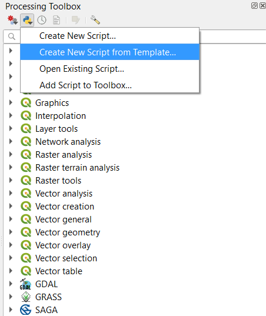

When looking at the window of the new script, you will see something like this:

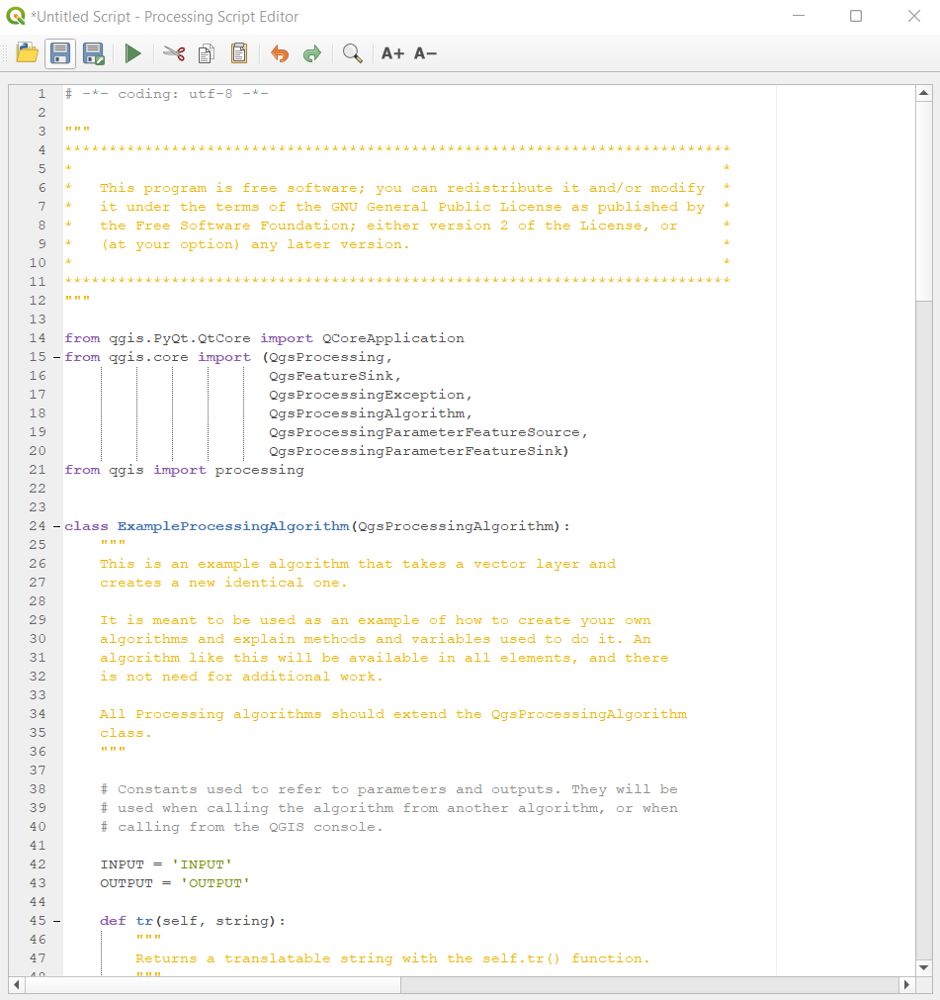

In the next section, we will walk through all the small, miscellaneous-looking parts of this code.

# Setting basic properties
This section is about setting the smaller methods and the main class up to display the correct name and script group of the script, as well as to display a proper helper string.

## Renaming your script
There are multiple steps to rename your script.

**TASK: rewrite the name of your main class from ExampleProcessingAlgorithm to something more meaningful (in this example, I will use HydroBasinProcessingAlgorithm).**

**TASK: write a docstring to your class.**

*Hint: something like this maybe:
    """
    This algorithm takes a DEM and a catchment shapefile,
    then computes the filled DEM, flow direction, catchment area,
    stream network, watersheds, river nodes, then selects the hydrologically
    correct catchment from the basins based on the original shapefile,
    to subsequently clip all output layers to the extent of it.
    """

**TASK: go on to the `createInstance()` method and change the return name to your algorithm name.**

**TASK: in the `name()` method, change the return value to the lowercase name of the name you want your algorithm to be called from the Toolbox. In this case, I will use hydrobasincreator.**

**TASK: in the `displayName()` method, change the return value inside `self.tr()` to the actual name you want to display. In this case, I will use HydroBasinCreator.**

*With the `tr()` method, you do not need to do anything, it works fine with any name.*

In the end of these changes, which you should do in all scripts you might write in the future, the script should look something like this:

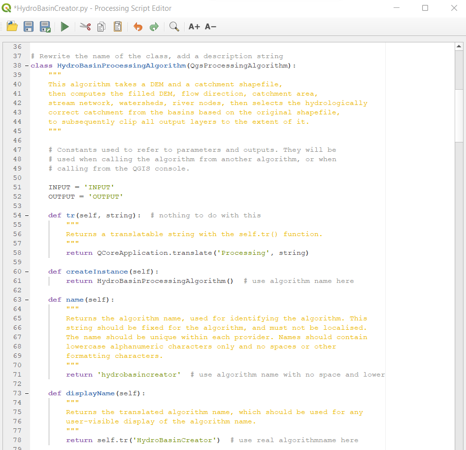

Now that you have changed the name of your script, it is time to save it.

**TASK: save your script to the default location, something like this: `C:\Users\username\AppData\Roaming\QGIS\QGIS3\profiles\default\processing\scripts`.**

## Set subgroup of your string
Subgrouping your scripts is important to organise them. It does not affect their subfolders when saving, only their representation in the Toolbox.

**TASK: at the groups method, rewrite the return self.tr value to a subgroup name that makes sense to you. For the sake of simplicity, I will use scripts this time.**

**TASK: at the groupId method, rewrite the return value to the same value you chose in the previous task.**

This way, the toolbox will show "scripts" as a subgroup when you open your script.

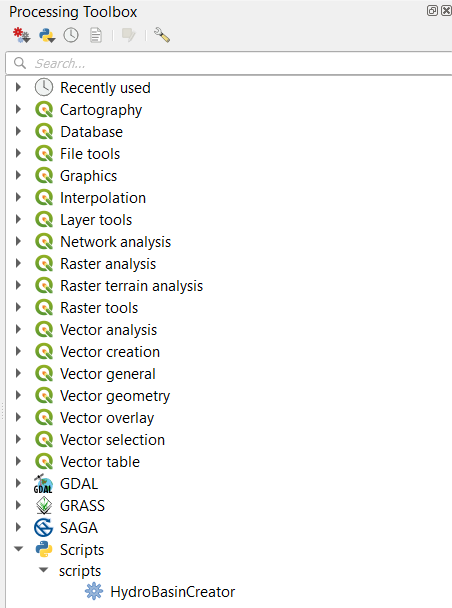

At the end of this stage, your group part should look like this:

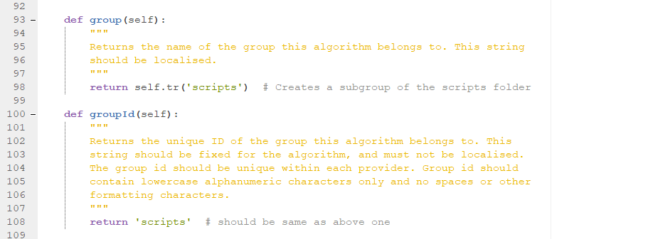

## Write short helper string
The last one of these smaller methods is the `shortHelpString()` method. This returns a short helping string for the algorithm, which will be displayed in the GUI.

**TASK: write a short helping string for the algorithm.**

*Hint: I have written the following: Creates the hydrologically correct version of a catchment and returns catchment area, channel, junction layers.*

# initAlgorithm
This is the first large part of the code. Here we set the input and output parameters.

**TASK: remove the contents of the `initAlgorithm()` method.**

## Input parameters
The input parameters you add here, will be the ones the GUI asks from the user for the code to run. As mentioned in the beginning, the script will take two input layers:

1. Raw Digital Elevation Model
2. Catchment shapefile

Besides these, three numerical variables will be needed for the processing of the layers:

1. MINSLOPE for the Fill Sinks (wang & liu) algorithm
2. METHOD for the Catchment Area algorithm
3. THRESHOLD for the Channel Network and Drainage Basins algorithm

Overall, we need a rasterlayer (QgsProcessingParameterRasterLayer), a vector layer (QgsProcessingParameterVectorLayer) and three numbers (QgsProcessingParameterNumber) for our inputs.

**TASK: add the above three classes to the `from qgis.core import` part at the top of the file.**

With the necessary options imported, we can start writing the input parameters. The first one looks like this:
```
        # We add the input raster source. It can be any kind of raster layer
        self.addParameter(  # adds a parameter
            QgsProcessingParameterRasterLayer(  # raster layer
                self.DEM,  # referred to as the DEM constant
                self.tr('Input Digital Elevation Model'),  # text above the GUI input box
                [QgsProcessing.TypeRaster]  # type of accepted layers (only raster here)
            )
        )
```
**TASK: add the constant DEM = "DEM"  right after the constants INPUT and OUTPUT at the top of the file.**

The above framework works for every input parameter, only has to be adjusted for the types and names. Constants must be written for them, too.

*Actually, constants are not necessary, they are just a convenient way, especially at longer scripts, to modify the instances you use the name for a parameter without having to search or scroll down a lot.*

**TASK: remove the constants INPUT and OUTPUT as you will not need them.**

**TASK: create the vector layer (constant is CATCHMENT) parameter by yourself.**

With the layers out of the way, it's time for the numbers now.

The first one looks like this:
```
        # Add MINSLOPE number for the Fill Sinks (wang & liu) algorithm
        self.addParameter(  # add parameter
            QgsProcessingParameterNumber(  # number
                self.MINSLOPE,  # constant for it
                self.tr('Minimum slope for filling sinks'),  # text above the input box
                type=QgsProcessingParameterNumber.Double,  # type of number
                minValue=0,  # minimum value
                defaultValue=0.01  # default value
            )
        )
```

**TASK: create the other two number parameters (constants are CATCHMENTAREAMETHOD with min and default values at 0 and max value at 5, and CHANNELTHRESHOLD with min value 1 and default value 6).**

After all these have been done, your code should look like this:


## Output parameters
The output parameters here are the ones that will be returned by the algorithm, and will have output location boxes in the GUI. The script will return six layers, namely three rasters:

1. Filled Digital Elevation Model
2. Flow Direction Raster
3. Catchment Area Raster

And three vectors:

4. Channel Network Segments
5. Channel Network Nodes
6. Hydrologically Correct Basin Shape

Thus, we will need two types of output parameters - raster destionations (`QgsProcessingParameterRasterDestination`) and vector destinations (`QgsProcessingParameterVectorDestination`).

**TASK: add the above two parameter types to the imports.**

In the following, I will show you a sample code for each through the first parameter of each group:
```
        self.addParameter(  # add parameter
            QgsProcessingParameterRasterDestination(  # raster output
                self.DEMFILL,  # constant DEMFILL = 'DEMFILL' as inside name
                self.tr('Filled Digital Elevation Model')  # name in GUI above output bracket
            )
        )

        self.addParameter(  # add parameter
            QgsProcessingParameterVectorDestination(  # vector output
                self.CHANNELSEGMENTS,  # CHANNELSEGMENT = 'CHANNELSEGMENT' constant
                self.tr('Channel Network Segments')  # name in GUI above output bracket
            )
        )
```

*Notice haw there are no type constraints here, since it can only output the types it has been created for.*

**TASK: based on the two code samples, create the parameters for the remaining two rasters (FDIR = 'FDIR' and CATCHMENTAREA = 'CATCHMENTAREA') and two vectors (CHANNELNODES = 'CHANNELNODES'  and HYDROBASIN = 'HYDROBASIN').**

After all these have been done, your output parameters (right under your input parameters inside the initAlgorithm) should look something like this:

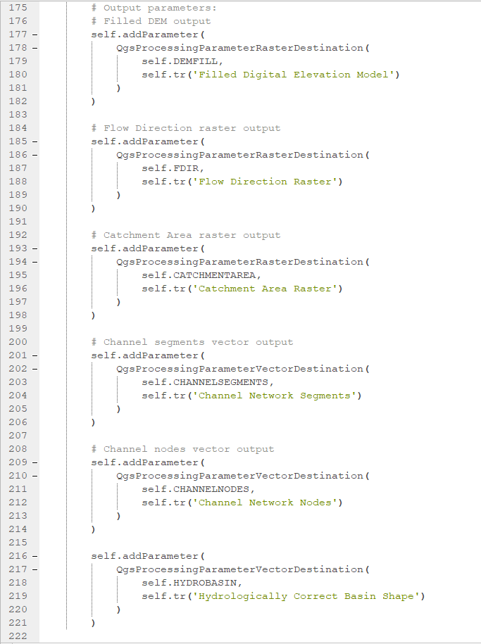

# processAlgorithm
The second larger part is the processAlgorithm method. This is where the actual processing takes place and this one returns our results too. We are now going to go through the important parts of it one by one, building up the whole method, and finishing our Processing Script.

**TASK: remove the contents of the processAlgorithm method.**

With an empty method now, free of distractions, we can start building our own processing toolset.

## Feedback
Feedback is the way of letting the GUI user know what is happening progress-wise in the tool. This is a crucial step in the code.

**TASK: at the top of the code, import `QgsProcessingMultistepFeedback` from the qgis.core module.**

We can define a feedback variable with the following code:
```
feedback = QgsProcessingMultiStepFeedback(6, feedback)  # 6 step feedback
```
After each chunk of the code (e.g. a processing tool) has been written, you can input the following code to make the feedback move:
```
        feedback.setCurrentStep(1)  # first step done (at second step, write 2)
        if feedback.isCanceled():  
            return {}  # if the user cancels the run, return empty dict
```
*You can do this as many times as you want, just set the number of the feedback variable to the highest you got to at the end.*

## Result dictionaries
**TASK: Right under the feedback variable, create (for this instance) three dictionaries called `results`, `proc_res`, and `outputs`.**

These ones will contain the final results of the script, the unclipped results of the processing algorithms, and all the outputs processing algorithms generate.

After this, the beginning of your processAlgorithm should look something like this:

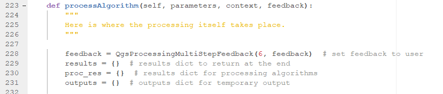

## Running processing algorithms inside a script
In this script, we are going to run three algorithms (Fill Sinks (wang & liu), Catchment Area, Channel Network and Drainage Basins), then implement the automatic basin choice and the clipping of the rasters using the Extract by Attribute, Clip, and Clip Raster by Mask Layer tools.

The way you run processing algorithms is almost the same inside the script as outside of it. There is a number of key differences, though.

1. Getting input parameters: you can get them from the `parameters` dictionary that has been generated based on the initAlgorithm. The keys of the dictionary are the same as your constants.
2. Storing outputs: the processing script should be assigned to a key of the `outputs` dictionary. If one of the processing outputs you want to send to the clipping at the end, assign it to the `proc_res` dictionary.
3. Running the algorithm itself: inside the `processing.run()` part, after the name and the parameters, write `context=context, feedback=feedback, is_child_algorithm=True`. This sets the feedback and context, and specifies that the algorithm runs inside the processingAlgorithm method.

The Fill Sinks (wang & liu) algorithm looks like this for example:
```
        # parameters dictionary
	params = {
            'ELEV': parameters['DEM'],
            'MINSLOPE':parameters['MINSLOPE'],
            'FDIR': QgsProcessing.TEMPORARY_OUTPUT,
            'FILLED': QgsProcessing.TEMPORARY_OUTPUT,
            'WSHED': QgsProcessing.TEMPORARY_OUTPUT
        }
        outputs['FILLSINKS'] = processing.run('saga:fillsinkswangliu', params, context=context, feedback=feedback, is_child_algorithm=True)
	# From the outputs dictionary's FILLSINKS key, containing all the fill sinks output, get the two result layers to proc_res
        proc_res['DEMFILL'] = outputs['FILLSINKS']['FILLED']  # get filled dem result
        proc_res['FDIR'] = outputs['FILLSINKS']['FDIR']  # get fdir result
	
        # Set feedback for current step
        feedback.setCurrentStep(1)  # fist step done
        if feedback.isCanceled():  # if the user cancels the run, return empty dict
            return {}
```
*Notice the two outputs to proc_res, those are going to be clipped and partake in the final results dict. Also, first step of the feedback triggered.*

If you want to use the outputs of this calculation, you can access it from the outputs dictionary. For example, here are the parameters of the Catchment Area algorithm:
```
        params = {
            'ELEVATION': outputs['FILLSINKS']['FILLED'],  # gets filled sink from outputs
            'METHOD': parameters['CATCHMENTAREAMETHOD'],
            'FLOW': QgsProcessing.TEMPORARY_OUTPUT #parameters['CATCHMENTAREA']
        }
```
This way, you can effectively chain processing algorithms!

**TASK: based on the above example, create the code for the Catchment Area and the Channel Network and Drainage Basins algorithms.**

*Note: be careful to assign outputs to clip to the proc_res dictionary and set the incremental steps of feedback.*

After this task, your processing code should look something like this:

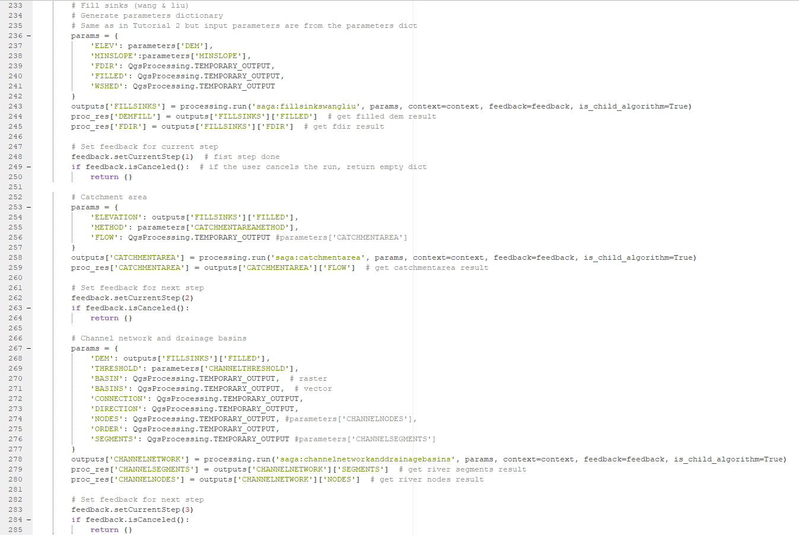

## Getting the hydrologically correct basin
The code for this part is basically identical to the one we had in the previous tutorial.

**TASK: based on the previous section, replicate the Intersection tool inside the script.**

With the intersection output, we can use the Field Calculator again. However, this time it looks a bit different, as we are going to use it in the same format as other processing algorithms:
```
        # Add field to the intersection result and calculate its area
        params = {
            'FIELD_LENGTH': 50,  # how many numbers fit inside
            'FIELD_NAME': 'area',  # name of new field
            'FIELD_PRECISION': 3,  # number of decimals
            'FIELD_TYPE': 0,  # filed type float
            'FORMULA': '$area',  # calculation formula
            'INPUT': outputs['INTERSECT']['OUTPUT'],  # from the intersection
            'NEW_FIELD': True,  # creates field by itself
            'OUTPUT': QgsProcessing.TEMPORARY_OUTPUT
        }
        outputs['INTERSECTAREA'] = processing.run('qgis:fieldcalculator', params, context=context, feedback=feedback, is_child_algorithm=True)
        
        # Set feedback for next step
        feedback.setCurrentStep(5)
        if feedback.isCanceled():
            return {}
```
The above code shows that you do not have to set context and scope in this case, the script has its own and it will only return those elements we tell it to return.

For the next part, getting the maximum area, we have to turn our `INTERSECTAREA` output into a map layer. This we will do with the `mapLayerFromString` command the following way:
```
        intersectarea_obj = QgsProcessingUtils.mapLayerFromString(outputs['INTERSECTAREA']['OUTPUT'], context)
```
*It needs the outputted location string and the context, which is the context of our script.*

**TASK: using the code from the previous tutorial, get the maximum area value, and, based on that, the ID of the feature we are looking for.**

**TASK: use the Extract by Attribute module with the MAX_ID variable to extract the appropriate basin from the basin vector output of the Channel Network and Drainage Basins tool.**

After you have done all these tasks, this part of your processAlgorithm should look something like this:

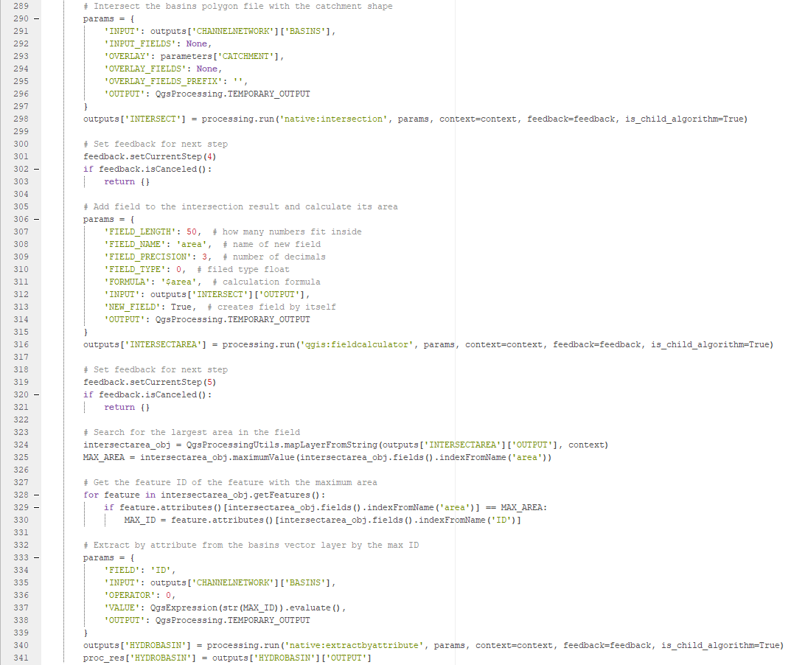

## Clipping outputs
Clipping the outputs is exactly the same as in Tutorial 2 in concept, with two main changes.

1. To check the type of the items, we have to have them as map layers, which means we have to use the `mapLayerFromString` method again. *Note: in the actual processing algorithm, you don't have to use the method, just the dictionary item is enough.*
2. The results should go into the `results` dictionary, as that will be returned in the end by the whole script.

**TASK: adapt the Tutorial 2 code to fill up the `results` dictionary with the clipped elements of the proc_res dictionary.**

The code should look something like this:

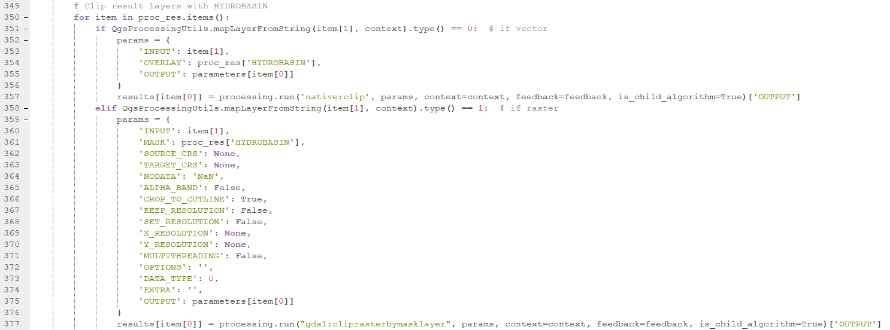

**TASK: below your if statement, return your `results` dictionary.**

## Logging to the main log window
It is useful sometimes to track your errors with simple log messages. In this case, if one of your layers fails for some reason, we will make it seen in the main log window of QGIS, which you can open by clicking on the small speech bubble in the bottom right of the GUI. To be able to log messages, you have to import the `QgsMessageLog` module from the `qgis.core` at the top of the file.

**TASK: in the if statement of the previous task, add an `else:` part which uses the `QgsMessageLog.logMessage()` function to write the name of the layer to the log window.**

It should look something like this:

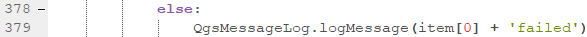

**TASK: save your script and your .qgz project.**

## Running the script from the GUI
With all the above code done and saved, you are now capable of running your tool from the GUI. In the processing toolbox, among the scripts, you will find it. By double-clicking on it, you can open up the GUI tool.

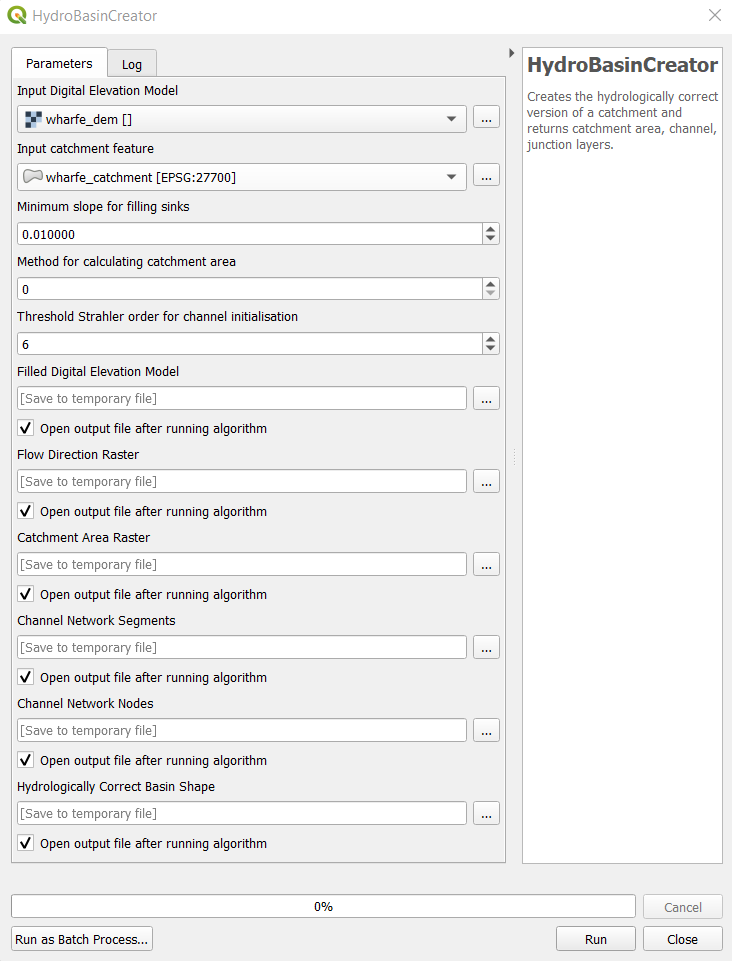

When running it with the default parameters, the output should look like this:

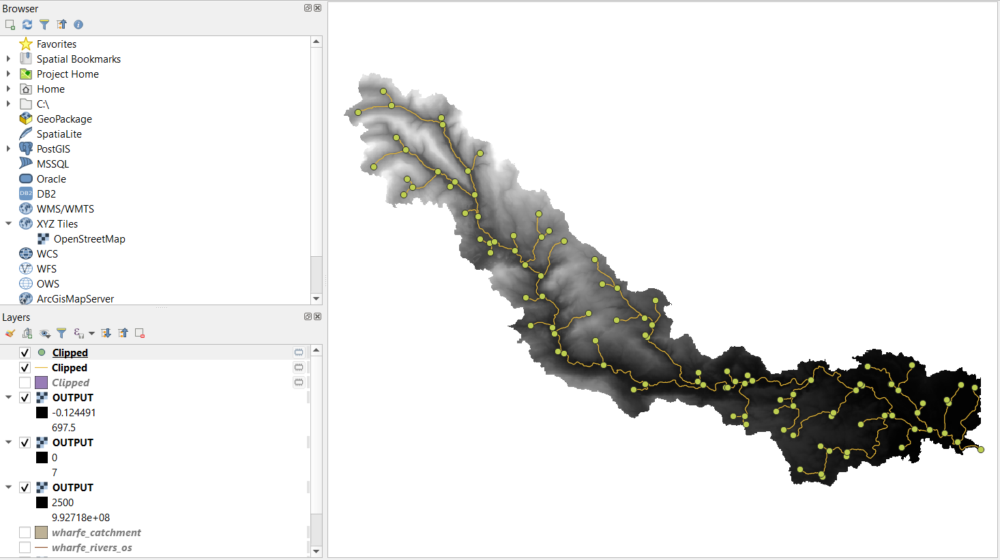

*Note: the names of the layers are not set here, but here is a link to a stackExchange thread which sorts it: https://gis.stackexchange.com/a/384996*

# Last steps
Congratulations, you have survived the PyQGIS tutorial! I hope it was of use to you and that it encourages you to look for solutions and improvements yourself in the future. Don't forget, the search engine is your best friend. Thank you for taking time to go through this resource!

&larr; [Tutorial 2](tutorialtwo.html)

&rarr; [Main page](index.html)

Finally, here is the full code for the processing script to help you see things as a whole:
```
# -*- coding: utf-8 -*-

"""
***************************************************************************
*                                                                         *
*   This program is free software; you can redistribute it and/or modify  *
*   it under the terms of the GNU General Public License as published by  *
*   the Free Software Foundation; either version 2 of the License, or     *
*   (at your option) any later version.                                   *
*                                                                         *
***************************************************************************
"""

from qgis.PyQt.QtCore import QCoreApplication
# Import all the processing parameters you need here
# FeatureSource removed from template
from qgis.core import (QgsProcessing,
                       QgsFeatureSink,
                       QgsProcessingException,
                       QgsProcessingAlgorithm,
                       QgsProcessingMultiStepFeedback,  # added
                       QgsProcessingParameterFeatureSink,
                       QgsProcessingParameterRasterLayer,  # added
                       QgsProcessingParameterVectorLayer,  # added
                       QgsProcessingParameterNumber,  # added
                       QgsProcessingParameterRasterDestination,  # added
                       QgsProcessingParameterVectorDestination,  # added
                       QgsMessageLog,  # added
                       QgsProcessingUtils,  # added
                       QgsFeatureRequest,  # added
                       QgsExpression,  # added
                       QgsVectorLayer,
                       QgsRasterLayer
                       )
from qgis import processing

# Rewrite the name of the class, add a description string
class HydroBasinProcessingAlgorithm(QgsProcessingAlgorithm):
    """
    This algorithm takes a DEM and a catchment shapefile,
    then computes the filled DEM, flow direction, catchment area,
    stream network, watersheds, river nodes, then selects the hydrologically
    correct catchment from the basins based on the original shapefile,
    to subsequently clip all output layers to the extent of it.
    """

    # Constants used to refer to parameters and outputs. They will be
    # used when calling the algorithm from another algorithm, or when
    # calling from the QGIS console.

    # Input constants
    DEM = 'DEM'  # define dem input
    CATCHMENT = 'CATCHMENT'  # define catchment shape input
    MINSLOPE = 'MINSLOPE'  # define minslope for Fill Sinks (wang & liu)
    CATCHMENTAREAMETHOD = 'CATCHMENTAREAMETHOD'  # define method for Catchment Area
    CHANNELTHRESHOLD = 'CHANNELTHRESHOLD'  # define Strahler order threshold for channel network
    # Output constants
    DEMFILL = 'DEMFILL'  # define fill dem output
    FDIR = 'FDIR'  # flow direction raster output
    CATCHMENTAREA = 'CATCHMENTAREA'  # define catchment area output
    # Channel Network and Drainage Basins output
    CHANNELNODES = 'CHANNELNODES'  # channel node points
    CHANNELSEGMENTS = 'CHANNELSEGMENTS'  # channel segment lines
    # Hydrologically correct basin
    HYDROBASIN = 'HYDROBASIN'
    
    def tr(self, string):  # nothing to do with this
        """
        Returns a translatable string with the self.tr() function.
        """
        return QCoreApplication.translate('Processing', string)

    def createInstance(self):
        return HydroBasinProcessingAlgorithm()  # use algorithm name here

    def name(self):
        """
        Returns the algorithm name, used for identifying the algorithm. This
        string should be fixed for the algorithm, and must not be localised.
        The name should be unique within each provider. Names should contain
        lowercase alphanumeric characters only and no spaces or other
        formatting characters.
        """
        return 'hydrobasincreator'  # use algorithm name with no space and lower

    def displayName(self):
        """
        Returns the translated algorithm name, which should be used for any
        user-visible display of the algorithm name.
        """
        return self.tr('HydroBasinCreator')  # use real algorithmname here

    def group(self):
        """
        Returns the name of the group this algorithm belongs to. This string
        should be localised.
        """
        return self.tr('scripts')  # Creates a subgroup of the scripts folder

    def groupId(self):
        """
        Returns the unique ID of the group this algorithm belongs to. This
        string should be fixed for the algorithm, and must not be localised.
        The group id should be unique within each provider. Group id should
        contain lowercase alphanumeric characters only and no spaces or other
        formatting characters.
        """
        return 'scripts'  # should be same as above one

    def shortHelpString(self):
        """
        Returns a localised short helper string for the algorithm. This string
        should provide a basic description about what the algorithm does and the
        parameters and outputs associated with it..
        """
        return self.tr("Creates the hydrologically correct version of a catchment and returns catchment area, channel, junction layers.")

    def initAlgorithm(self, config=None):
        """
        Here we define the inputs and output of the algorithm, along
        with some other properties.
        """
        # We add the input raster source. It can be any kind of raster layer
        self.addParameter(  # adds a parameter
            QgsProcessingParameterRasterLayer(  # raster layer
                self.DEM,  # referred to as the DEM constant
                self.tr('Input Digital Elevation Model'),  # text when hovering the cursor above
                [QgsProcessing.TypeRaster]  # type of accepted layers
            )
        )
        
        # We add the input vector layer with one feature. It must be a polygon.
        self.addParameter(
            QgsProcessingParameterVectorLayer(
                self.CATCHMENT,
                self.tr('Input catchment feature'),
                [QgsProcessing.TypeVectorPolygon]
            )
        )
        
        # Add MINSLOPE number for the Fill Sinks (wang & liu) algorithm
        self.addParameter(
            QgsProcessingParameterNumber(
                self.MINSLOPE,
                self.tr('Minimum slope for filling sinks'),
                type=QgsProcessingParameterNumber.Double,
                minValue=0,
                defaultValue=0.01
            )
        )
        
        # Add METHOD number for the Catchment Area algorithm
        self.addParameter(
            QgsProcessingParameterNumber(
                self.CATCHMENTAREAMETHOD,
                self.tr('Method for calculating catchment area'),
                type=QgsProcessingParameterNumber.Integer,
                minValue=0,
                maxValue=5,
                defaultValue=0
            )
        )
        
        # Add Strahler order threshold for Channel Network and Drainage Basins
        self.addParameter(
            QgsProcessingParameterNumber(
                self.CHANNELTHRESHOLD,
                self.tr('Threshold Strahler order for channel initialisation'),
                type=QgsProcessingParameterNumber.Integer,
                minValue=1,  # Starting Strahler order for a stream
                defaultValue=6  # works well with the Wharfe, depends on others
            )
        )
        
        # Output parameters:
        # Filled DEM output
        self.addParameter(
            QgsProcessingParameterRasterDestination(
                self.DEMFILL,
                self.tr('Filled Digital Elevation Model')
            )
        )
        
        # Flow Direction raster output
        self.addParameter(
            QgsProcessingParameterRasterDestination(
                self.FDIR,
                self.tr('Flow Direction Raster')
            )
        )
        
        # Catchment Area raster output
        self.addParameter(
            QgsProcessingParameterRasterDestination(
                self.CATCHMENTAREA,
                self.tr('Catchment Area Raster')
            )
        )
        
        # Channel segments vector output
        self.addParameter(
            QgsProcessingParameterVectorDestination(
                self.CHANNELSEGMENTS,
                self.tr('Channel Network Segments')
            )
        )
        
        # Channel nodes vector output
        self.addParameter(
            QgsProcessingParameterVectorDestination(
                self.CHANNELNODES,
                self.tr('Channel Network Nodes')
            )
        )
        
        self.addParameter(
            QgsProcessingParameterVectorDestination(
                self.HYDROBASIN,
                self.tr('Hydrologically Correct Basin Shape')
            )
        )

    def processAlgorithm(self, parameters, context, feedback):
        """
        Here is where the processing itself takes place.
        """

        feedback = QgsProcessingMultiStepFeedback(6, feedback)  # set feedback to user
        results = {}  # results dict to return at the end
        proc_res = {}  # results dict for processing algorithms
        outputs = {}  # outputs dict for temporary output
        
        # Fill sinks (wang & liu)
        # Generate parameters dictionary
        # Same as in Tutorial 2 but input parameters are from the parameters dict
        params = {
            'ELEV': parameters['DEM'],
            'MINSLOPE':parameters['MINSLOPE'],
            'FDIR': QgsProcessing.TEMPORARY_OUTPUT,
            'FILLED': QgsProcessing.TEMPORARY_OUTPUT,
            'WSHED': QgsProcessing.TEMPORARY_OUTPUT
        }
        outputs['FILLSINKS'] = processing.run('saga:fillsinkswangliu', params, context=context, feedback=feedback, is_child_algorithm=True)
        proc_res['DEMFILL'] = outputs['FILLSINKS']['FILLED']  # get filled dem result
        proc_res['FDIR'] = outputs['FILLSINKS']['FDIR']  # get fdir result
        
        # Set feedback for current step
        feedback.setCurrentStep(1)  # fist step done
        if feedback.isCanceled():  # if the user cancels the run, return empty dict
            return {}

        # Catchment area
        params = {
            'ELEVATION': outputs['FILLSINKS']['FILLED'],
            'METHOD': parameters['CATCHMENTAREAMETHOD'],
            'FLOW': QgsProcessing.TEMPORARY_OUTPUT #parameters['CATCHMENTAREA']
        }
        outputs['CATCHMENTAREA'] = processing.run('saga:catchmentarea', params, context=context, feedback=feedback, is_child_algorithm=True)
        proc_res['CATCHMENTAREA'] = outputs['CATCHMENTAREA']['FLOW']  # get catchmentarea result
        
        # Set feedback for next step
        feedback.setCurrentStep(2)
        if feedback.isCanceled():
            return {}
        
        # Channel network and drainage basins
        params = {
            'DEM': outputs['FILLSINKS']['FILLED'],
            'THRESHOLD': parameters['CHANNELTHRESHOLD'],
            'BASIN': QgsProcessing.TEMPORARY_OUTPUT,  # raster
            'BASINS': QgsProcessing.TEMPORARY_OUTPUT,  # vector
            'CONNECTION': QgsProcessing.TEMPORARY_OUTPUT,
            'DIRECTION': QgsProcessing.TEMPORARY_OUTPUT,
            'NODES': QgsProcessing.TEMPORARY_OUTPUT, #parameters['CHANNELNODES'],
            'ORDER': QgsProcessing.TEMPORARY_OUTPUT,
            'SEGMENTS': QgsProcessing.TEMPORARY_OUTPUT #parameters['CHANNELSEGMENTS']
        }
        outputs['CHANNELNETWORK'] = processing.run('saga:channelnetworkanddrainagebasins', params, context=context, feedback=feedback, is_child_algorithm=True)
        proc_res['CHANNELSEGMENTS'] = outputs['CHANNELNETWORK']['SEGMENTS']  # get river segments result
        proc_res['CHANNELNODES'] = outputs['CHANNELNETWORK']['NODES']  # get river nodes result
        
        # Set feedback for next step
        feedback.setCurrentStep(3)
        if feedback.isCanceled():
            return {}
        
        #### Get the hydrologically correct basin
        
        # Intersect the basins polygon file with the catchment shape
        params = {
            'INPUT': outputs['CHANNELNETWORK']['BASINS'],
            'INPUT_FIELDS': None,
            'OVERLAY': parameters['CATCHMENT'],
            'OVERLAY_FIELDS': None,
            'OVERLAY_FIELDS_PREFIX': '',
            'OUTPUT': QgsProcessing.TEMPORARY_OUTPUT
        }
        outputs['INTERSECT'] = processing.run('native:intersection', params, context=context, feedback=feedback, is_child_algorithm=True)
        
        # Set feedback for next step
        feedback.setCurrentStep(4)
        if feedback.isCanceled():
            return {}
        
        # Add field to the intersection result and calculate its area
        params = {
            'FIELD_LENGTH': 50,  # how many numbers fit inside
            'FIELD_NAME': 'area',  # name of new field
            'FIELD_PRECISION': 3,  # number of decimals
            'FIELD_TYPE': 0,  # filed type float
            'FORMULA': '$area',  # calculation formula
            'INPUT': outputs['INTERSECT']['OUTPUT'],
            'NEW_FIELD': True,  # creates field by itself
            'OUTPUT': QgsProcessing.TEMPORARY_OUTPUT
        }
        outputs['INTERSECTAREA'] = processing.run('qgis:fieldcalculator', params, context=context, feedback=feedback, is_child_algorithm=True)
        
        # Set feedback for next step
        feedback.setCurrentStep(5)
        if feedback.isCanceled():
            return {}
        
        # Search for the largest area in the field
        # Create an object from the reference string returned by the algorithm
        intersectarea_obj = QgsProcessingUtils.mapLayerFromString(outputs['INTERSECTAREA']['OUTPUT'], context)
        MAX_AREA = intersectarea_obj.maximumValue(intersectarea_obj.fields().indexFromName('area'))
        
        # Get the feature ID of the feature with the maximum area
        for feature in intersectarea_obj.getFeatures():
            if feature.attributes()[intersectarea_obj.fields().indexFromName('area')] == MAX_AREA:
                MAX_ID = feature.attributes()[intersectarea_obj.fields().indexFromName('ID')]
        
        # Extract by attribute from the basins vector layer by the max ID
        params = {
            'FIELD': 'ID',
            'INPUT': outputs['CHANNELNETWORK']['BASINS'],
            'OPERATOR': 0,
            'VALUE': QgsExpression(str(MAX_ID)).evaluate(),
            'OUTPUT': QgsProcessing.TEMPORARY_OUTPUT
        }
        outputs['HYDROBASIN'] = processing.run('native:extractbyattribute', params, context=context, feedback=feedback, is_child_algorithm=True)
        proc_res['HYDROBASIN'] = outputs['HYDROBASIN']['OUTPUT']

        # Set feedback for next step
        feedback.setCurrentStep(6)
        if feedback.isCanceled():
            return {}
        
        # Clip result layers with HYDROBASIN
        for item in proc_res.items():
            if QgsProcessingUtils.mapLayerFromString(item[1], context).type() == 0:  # if vector
                params = {
                    'INPUT': item[1],
                    'OVERLAY': proc_res['HYDROBASIN'],
                    'OUTPUT': parameters[item[0]]
                }
                results[item[0]] = processing.run('native:clip', params, context=context, feedback=feedback, is_child_algorithm=True)['OUTPUT']
            elif QgsProcessingUtils.mapLayerFromString(item[1], context).type() == 1:  # if raster
                params = {
                    'INPUT': item[1],
                    'MASK': proc_res['HYDROBASIN'],
                    'SOURCE_CRS': None,
                    'TARGET_CRS': None,
                    'NODATA': 'NaN',
                    'ALPHA_BAND': False,
                    'CROP_TO_CUTLINE': True,
                    'KEEP_RESOLUTION': False,
                    'SET_RESOLUTION': False,
                    'X_RESOLUTION': None,
                    'Y_RESOLUTION': None,
                    'MULTITHREADING': False,
                    'OPTIONS': '',
                    'DATA_TYPE': 0,
                    'EXTRA': '',
                    'OUTPUT': parameters[item[0]]
                }
                results[item[0]] = processing.run("gdal:cliprasterbymasklayer", params, context=context, feedback=feedback, is_child_algorithm=True)['OUTPUT']
            else:
                QgsMessageLog.logMessage(item[0] + 'failed')
        # Return the final dictionary of the clipped results
        return results
```
