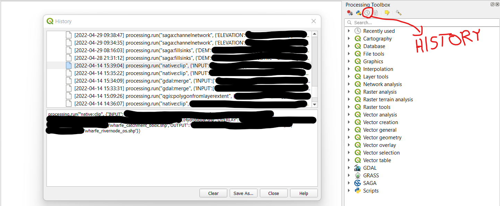
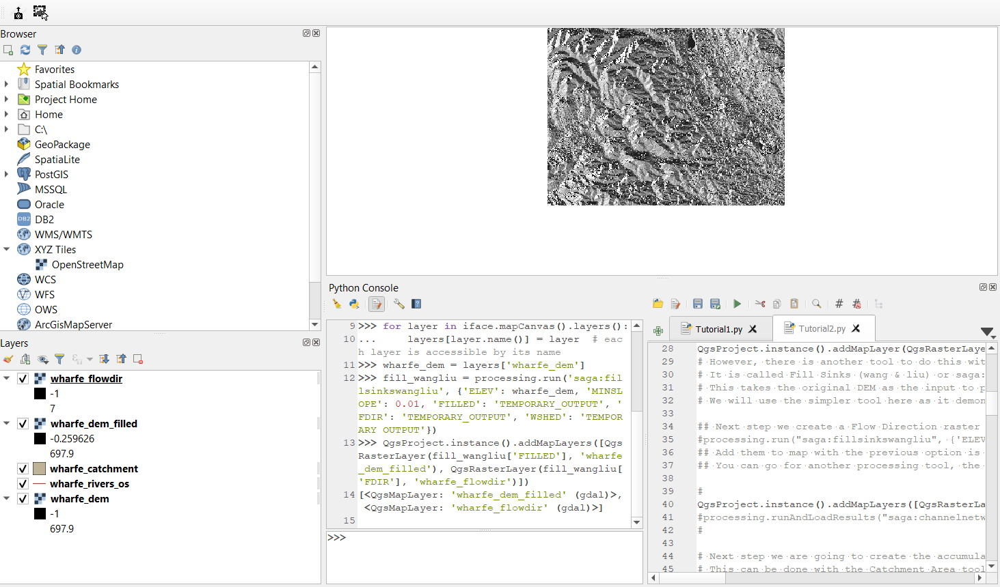
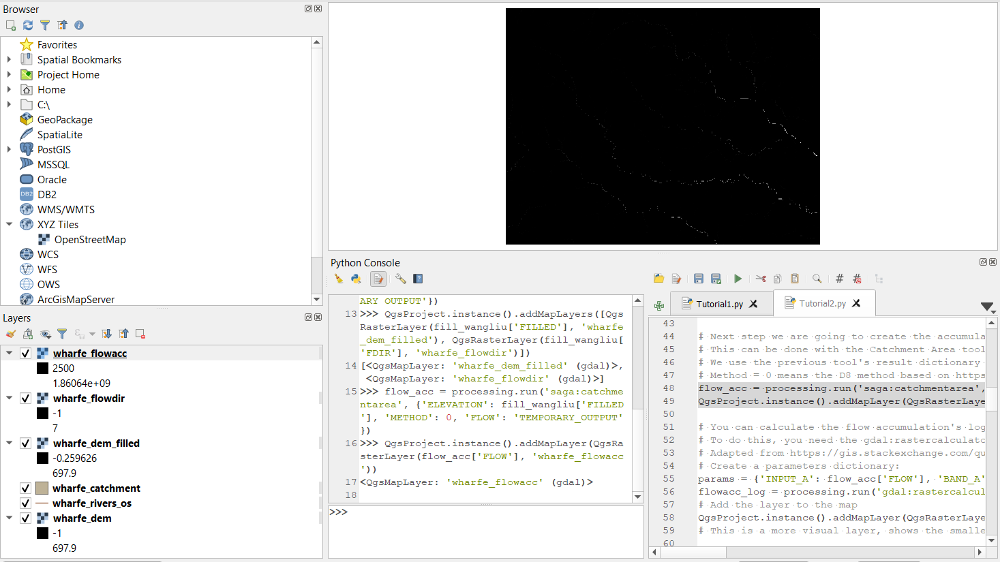
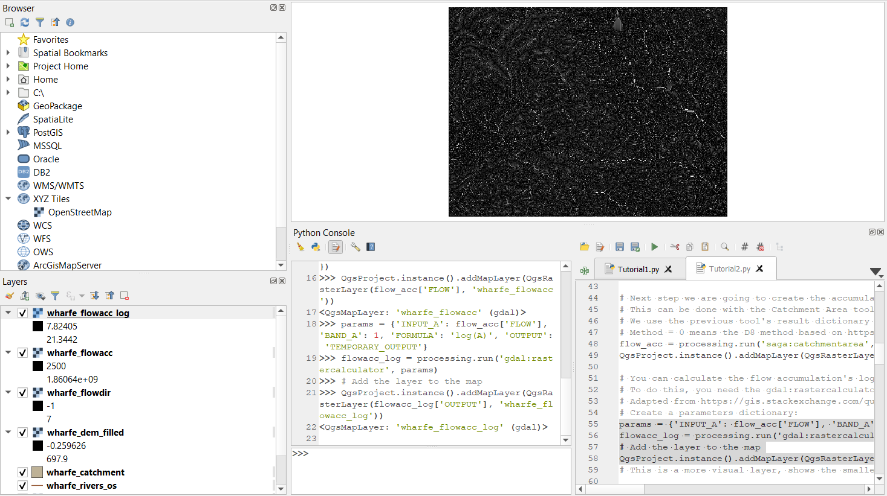
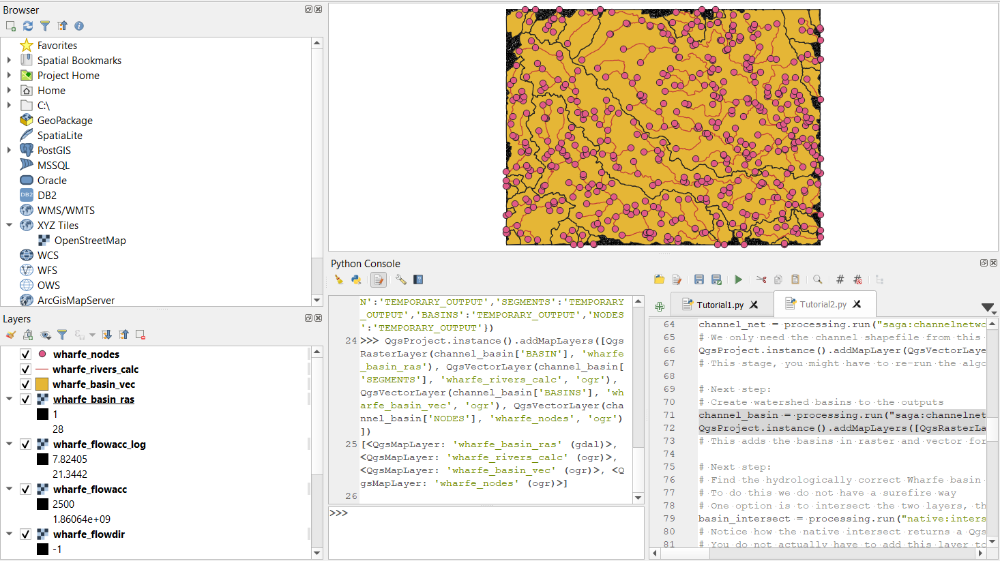
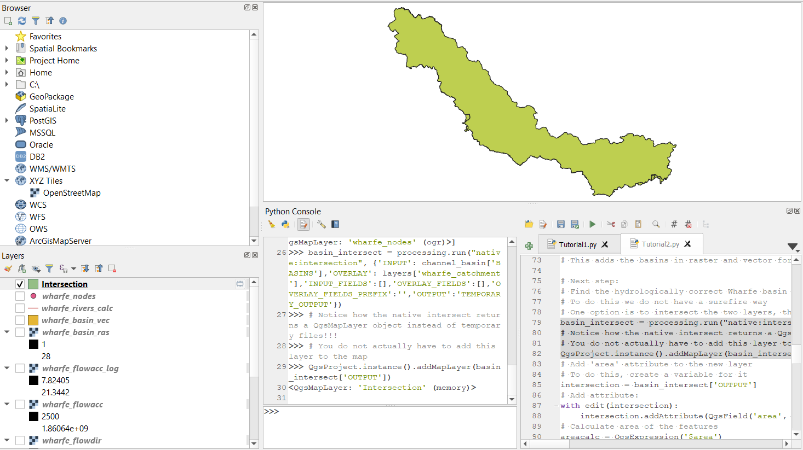
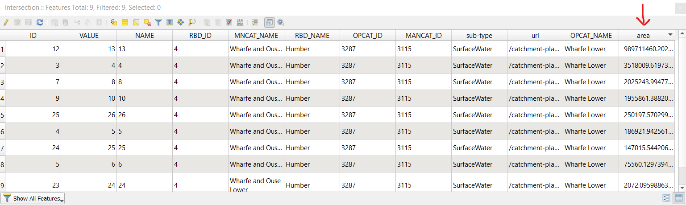

# Introduction
This tutorial has been made as an output of my 70-hour placement project for GEOG5230M Professional Development at MSc River Basin Dynamics and Management with GIS at the University of Leeds. The aim of this project is to showcase a possible solution for creating an e-learning tool to teach Python in QGIS to students in water-related fields.

To complete these tutorials, a basic understanding of Python, its data structures, functions, and classes is required, as well as some familiarity with the desktop usage of QGIS3. To follow the tutorial, an installation of QGIS 3.10 A Coruna Long Term Release is required. The code has not been tested and adapted to other versions of QGIS, although it might work with them.

This is the second tutorial, talking about processing algorithms and their usage from the PyQGIS Console.

# Table of Contents

- [Introduction](#introduction)
- [The task](#the-task)
- [First steps](#first-steps)
- [Running processing algorithms](#running-processing-algorithms)
- [Fill Sinks and Flow Direction](#fill-sinks-and-flow-direction)
- [Catchment Area](#catchment-area)
- [Channel Network and Drainage Basins](#channel-network-and-drainage-basins)
- [Finding the hydrologically correct Wharfe basin](#finding-the-hydrologically-correct-wharfe-basin)
	* [Intersect hydrological basins with catchment shape](#intersect-hydrological-basins-with-catchment-shape)
	* [Calculate area of intersected subbasins](#calculate-area-of-intersected-subbasins)
	* [Obtain the largest subbasin](#obtain-the-largest-subbasin)
	* [Clip all layers with the hydrologically correct Wharfe basin](#clip-all-layers-with-the-hydrologically-correct-wharfe-basin)
- [Last steps](#last-steps)

# The task
This tutorial has been made for hydrology students, so it will showcase the necessary knowledge of PyQGIS through a water-related project. Hydraulic modelling is an extremely important part of modern hydrologists' work, as it is used in everything from modelling nutrient pollution to creating flood risk representations. However, the modelling software needs quality outputs, as otherwise the "garbage in, garbage out" principle takes effect. For this reason, inputs must be pre-processed and hydrologically corrected to create the most favourable conditions for model running.

This tutorial uses the appropriate processing algorithms and bespoke code to take in a catchment shapefile and a Digital Elevation Model, then produce the hydrologically corrected DEM and other layers, such as river segments, nodes, catchment area, etc. Our river of choice for this task is the Wharfe, which runs to the north of Leeds, with many documented flood events and important water quality issues as parts of it are designated bathing locations.

# First steps
We are going to take up the work from where we left off in the last tutorial. Open up your project with the Wharfe's raster and vector layers in it, open the Console and the Editor, which should retain your Tutorial1.py file.

**TASK: create a Tutorial2.py file in the Editor.**

**TASK: get your layers into the layers dictionary the way we learned last time.**

Now with everything reset to the previous state, we can start working on the hydrological workflow. To achieve our goals, we will use the processing algorithms of the SAGA algorithm provider which comes natively with QGIS. We will also use some of the native processing algorithms.

# Running processing algorithms
To run processing algorithms in the PyQGIS Console, you have to start with the `processing.run(<COMMAND>, <PARAMETERS>)` command. This takes the command you want to run as a script, and the parameters as a disctionary. The easiest way to obtain the right parameters is to run the tool from the GUI and then look it up in the History. History is available from the processing toolbox, clicking on the clock icon at the top.



This method yields us all the information we need to run the scripts. If additional information is required, the SAGA framework has a useful webpage.

*If you would like to examine more the options you have regarding processing algorithms, just run them from the GUI and look at them afterwards in the history.*

# Fill Sinks and Flow Direction
The first step is filling the sinks and creating a flow direction raster. These steps are separate in ArcGIS, but in QGIS, there is a tool called Fill Sinks (wang & liu), which does it in one step. To run the script, we must create the parameters first.
```
parameters = {
	'ELEV': wharfe_dem,
	'MINSLOPE': 0.01,
	'FILLED': 'TEMPORARY_OUTPUT',
	'FDIR': 'TEMPORARY_OUTPUT',
	'WSHED': 'TEMPORARY_OUTPUT'
	}
```
With the parameters now set, we can run the tool. We assign it to a variable to preserve the outputs.
```
fill_wangliu = processing.run('saga:fillsinkswangliu', parameters)
```

This returns a dictionary with the keys "FILLED", "FDIR", "WHSED". From this, we will only need the first two, the watersheds we will create later.

*In the processing script, the algorithm provider is stated, then a colon, then the tool.*
*There is also a Fill Sinks tool, which only creates a filled DEM.*

**TASK: add the FILLED and FDIR layers to the map.**

*Hint: you can use the QgsProject.instance().addMapLayers() command and the QgsRasterLayer() command to do this task.*

This algorithm removed the sinks from our DEM and created a flow direction raster.



# Catchment Area
The next step is calculating the Catchment Area (or Flow Accumulation in ArcGIS and some QGIS versions). This needs the filled DEM as the "ELEVATION"  key, a "METHOD" and a "FLOW", which is the output to the same temporary output as the previous ones. The method is an integer, in this case 0, which means the D8 method, where water can flow from a cell to the eight neighbouring ones.

**TASK: create the parameters dictionary for the Catchment Area tool.**

After the parameters dict, run the tool with the following code:
```
flow_acc = processing.run('saga:catchmentarea', parameters)
```
**TASK: add the resulting "FLOW" layer to the map.**



*OPTIONAL!*
*For the human eye, this does not tell much, as the difference between numbers is too large for a detailed view. For this reason, it might be useful to calculate the 10-based logarithm of the Flow raster. This can be done with the following code:*
```
params = {'INPUT_A': flow_acc['FLOW'], 'BAND_A': 1, 'FORMULA': 'log(A)', 'OUTPUT': 'TEMPORARY_OUTPUT'}
flowacc_log = processing.run('gdal:rastercalculator', params)
```
*Adding this layer to the map, you can see much more understandable results for the human eye.



# Channel Network and Drainage Basins
Once we have the flow accumulation raster, we are able to create the channels and drainage basins/catchments. For this, we use the Channel Network and Drainage Basins tool.

**TASK: find the parameters you need for the calculation by running the tool from the GUI and looking it up in the History.**

**TASK: run the 'saga:channelnetworkanddrainagebasins' tool in the Console and assign it to the "channel_basin" variable.**

**TASK: from the resulting layers, add the BASIN, BASINS, SEGMENTS, NODES to the map. Are the rivers alike the ones from the wharfe_rivers_os?**



*Hint: if you do not manage to obtain the appropriate layers, search for the SAGA tool documentation on the internet.*

# Finding the hydrologically correct Wharfe basin
Until now, we just ran different processing scripts to obtain the layers we need, but here we will have to use a bit of bespoke code. The task is to automatically choose, from the previous tool's basins vector layer, the basin of the Wharfe. Manually, this is quite easy, but QGIS does not know how to do it the same way. This means that we have to devise a method that yields us the correct feature of the basins layer.

## Intersect hydrological basins with catchment shape
Firstly, we have to get the intersection of the basins layer and the original catchment shapefile. This will yield us the basins that are partially covered by the catchment shapefile as it does not have the exact same dimensions in most cases as the one created from the DEM. This means that we are likely to encounter with one large and several smaller features in the intersection result. To run the code, we are using the Intersection tool from the native library:
```
parameters = {
	'INPUT': channel_basin['BASINS'],  # cutting out from this layer
	'OVERLAY': layers['wharfe_catchment'],  # with this layer
	'INPUT_FIELDS':[],  # all fields to be transferred
	'OVERLAY_FIELDS':[],  # all fields to be transferred
	'OVERLAY_FIELDS_PREFIX':'',  # no prefix needed for the overlay's fields in the output
	'OUTPUT':'TEMPORARY_OUTPUT'}
basin_intersect = processing.run("native:intersection", parameters)
```
**TASK: observe the results of the intersection. Visually, how do you find the size distribution of features?**



## Calculate area of intersected subbasins
Now that we have our intersection result, the next step is to choose the largest one of them, since that is the most likely to be the hydrologically correct Wharfe basin. To do this, we have to add and calculate the "area" field to the attribute table. To do this, we can use a calculation expression just as in the first tutorial.
```
with edit(intersection):
    intersection.addAttribute(QgsField('area', QVariant.Double))

# Calculate area of the features
areacalc = QgsExpression('$area')  # expression
areacalcContext = QgsExpressionContext()  # context
areacalcContext.appendScopes(QgsExpressionContextUtils.globalProjectLayerScopes(intersection))  # scope
with edit(intersection):
    for f in intersection.getFeatures():
        areacalcContext.setFeature(f)
        f['area'] = areacalc.evaluate(areacalcContext)
        intersection.updateFeature(f)
```
**TASK: open the attribute table of the intersection result and look at the layer areas. Are there any outliers?**



## Obtain the largest subbasin
With the areas calculated, we have to obtain the ID of the largest one. To do this, we have to get the largest area first.
```
max_area = intersection.maximumValue(intersection.fields().indexFromName('area'))
```
*The indexFromName() method looks for the numeric index of a field with the set name. The maximumValue() method returns the maximum value of a field.*

With the maximum area known, we can get the ID of that layer. We iterate over the features in the intersection and get the ID of the feature with matching area:
```
for feature in intersection.getFeatures():
    if feature.attributes()[intersection.fields().indexFromName('area')] == max_area:
        max_id = feature.attributes()[intersection.fields().indexFromName('ID')]
```
Once we have the appropriate ID, we can use the native Extract by Attribute algorithm to obtain our basin from the basins vector layer:
```
parameters = {
	'INPUT': channel_basin['BASINS'],
	'FIELD':'ID',
	'OPERATOR':0,
	'VALUE':max_id,
	'OUTPUT':'TEMPORARY_OUTPUT'
	}
wharfe_hydro = processing.run("native:extractbyattribute", parameters)
```
This yields us a new layer with only one feature, the hydrologically correct Wharfe basin. We can now use this to clip all the layers and create the needed output for any modelling task.

**TASK: add the output layer to the map, rename the output layer to "wharfe_hydro".**

*Hint: on mapLayer objects, you can use the setName() method to rename them. You have to refresh your layers dict for it to appear in it.*

**wharfe pic here**

## Clip all layers with the hydrologically correct Wharfe basin
Clipping the layers with the hydrologically correct Wharfe basin yields us the minimum needed size of information. Also, it does not lead our future models astray with unnecessary data.

**TASK: assign your wharfe_hydro layer to the wharfe_hydro variable for clipping.**

To clip the layers, we have to distinguish between them. For vector layers, you can use the native Clip tool, and for rasters, you can use gdal's Clip by Mask Layer tool. But how do we distinguish between the two types?

**TASK: update your layers dictionary.**

We can observe the type() of a layer to decide if they are vector or raster. Every layer has a .type() method which returns 0 for vector, 1 for raster layers.

**TASK: iterating over each element of the dictionary, construct an if statement that recognises, and clips vector layers, sets their name, then outputs them to the map. It should do the same with rasters. Be careful to set all the layers you want to clip visible!**

**clipped pic here**

# Last steps
With the clipped layers now ready, we have reached the end of the second tutorial phase. Great work so far, now there is only one part left, where we will turn our code into a GUI-based processing script.

Oh, and if you are struggling with the last task, here is my code to solve it:
```
for item in layers.items():
    if item[1].type() == 0:  # chack type
        print('vector')
        # Adapted from https://opensourceoptions.com/blog/pyqgis-clip-vector-layers/
		parameters = {
			'INPUT': item[1],
			'OVERLAY': wharfe_hydro,
			'OUTPUT': 'TEMPORARY_OUTPUT'
			}
        vec = processing.run('native:clip', parameters)
        vec['OUTPUT'].setName(item[0] + '_clip')
        QgsProject.instance().addMapLayer(vec['OUTPUT'])
    elif item[1].type() == 1:  # check type
        print('raster')
        # Adapted from https://docs.qgis.org/3.22/en/docs/user_manual/processing_algs/gdal/rasterextraction.html
		parameters = {
			'INPUT':item[1],
			'MASK':wharfe_hydro,
			'SOURCE_CRS':None,
			'TARGET_CRS':None,
			'NODATA':'NaN',
			'ALPHA_BAND':False,
			'CROP_TO_CUTLINE':True,
			'KEEP_RESOLUTION':False,
			'SET_RESOLUTION':False,
			'X_RESOLUTION':None,
			'Y_RESOLUTION':None,
			'MULTITHREADING':False,
			'OPTIONS':'',
			'DATA_TYPE':0,
			'EXTRA':'',
			'OUTPUT':'TEMPORARY_OUTPUT'
			}
        ras = processing.run("gdal:cliprasterbymasklayer", parameters)
        QgsProject.instance().addMapLayer(QgsRasterLayer(ras['OUTPUT'], item[0] + '_clip'))
```

**TASK: save your Tutorial2.py file in the Editor. You can save the layers to file or remove them, you will only need the original DEM and the original catchment for the next tutorial.**

**TASK: save your QGIS project with the method learned in the first tutorial.**

&rarr; [Tutorial 3](tutorialthree.html)

&larr; [Tutorial 1](tutorialone.html)

&uarr; [Main page](index.html)
