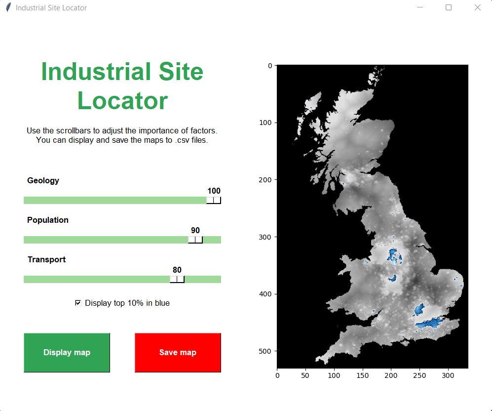
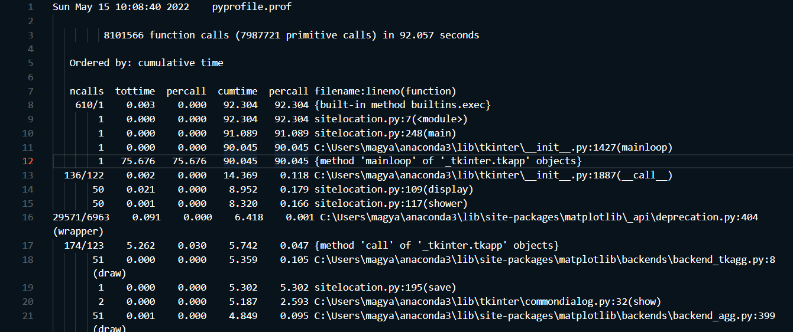
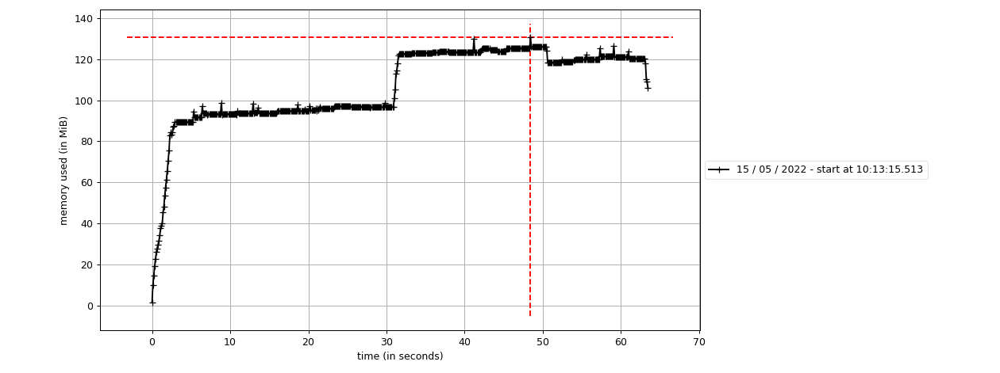

The purpose of this page is to showcase and describe the industrial site locator application made for Assignment 2 of GEOG5990M Programming for Geographical Information Analysis: Core Skills.

# Table of Contents
- [Description](#description)
- [Development and Issues](#development-and-issues)
- [Testing](#testing)
- [Profiling](#profiling)
  * [Runtime profiling](#runtime-profiling)
  * [Memory profiling](#memory-profiling)

# Description
This application enables the users to choose between industrial site locations on a raster map of Great Britain. The software uses three maps as input, with values between 0 and 255, depicting the geology, population, and transport characteristics of areas. These maps are then averaged based on their relative importance, which is set by the user, using three scalebars. Then it displays the map chosen by the user on a greyscale image, optionally with the top 10% of values in a blue colour scheme. The displayed maps can be saved as .csv files to any location specified by the user through a pop-up file dialog window. For technical information, and guidelines on installing and running the application, please refer to the [README](https://github.com/simagyari/GEOG5990M_Assignment2/blob/main/README.md) file of the [project repository](https://github.com/simagyari/GEOG5990M_Assignment2). To get to know more about the classes, methods, and the code itself, please refer to the [documentation](build/index.html).

# Development and Issues
The development of this application followed the requirements laid out in the assignment description, the development took approximately 5 hours of net coding time. The Jupyter Notebook was created using [Python](https://www.python.org/) 3.9.7. through the [Anaconda](https://www.anaconda.com/) distribution and [Microsoft Visual Studio Code](https://code.visualstudio.com/) version 1.66.0 with the following extensions to facilitate the usage of Notebooks:
- Jupyter v2022.4.1021342353
- Jupyter Keymap v1.0.0
- Jupyter Notebook Renderers v1.0.6
- Gather v2022.3.0

The issues arising during development were the following:
1. Handling the matplotlib backends in the IPython kernel - To make matplotlib plot in popup windows instead of the default inline option of the Jupyter Notebook, the `%matplotlib qt` magic command is needed. This one, however, interferes with the usage of the TkAgg backend of matpltolib, needed for plotting in the tkinter windows. The issue has not been completely resolved, it only works if the cell containing the imports is only loaded once during the application run. More information on avoiding this problem can be found in the [README](https://github.com/simagyari/GEOG5990M_Assignment2/blob/main/README.md).
2. Choosing colour scheme for plotting the top 10% of suitability in blue - Since the lightness of the blue had to reflect the values, a custom colour scheme was created. The lower 90% of it is the default "gray" matplotlib colourmap, while the top is a scarcely sampled version of the bottom 90% of the "Blues_r" colourmap. This enables the user to better distinguish between gray and blue parts than using the top 10% of the blue colourmap, which would have yielded almost uniformly white values. This way the best parts are clearly delineated by the contrast of light gray and dark blue, and the highest percentages still remain high, but distinguishably from the light gray.
3. Deciding when toggling the blue display should trigger the display of the map - Since for the first display the map must be opened with the `Display map` button, not the otherwise refreshing blue checkbox, the visibility of the matplotlib Axes object had to be checked. Since no in-built method was found for this, a new object attribute was created, with a boolean value, defaulting to False. Clicking the `Display map` button sets the attribute to True, enabling the blue checkbox to trigger further displays.
4. Suppressing error message after cancelled save - Since the `asksaveasfilename` function of tkinter returns the filepath the user specifies, in the case a cancel event happens in the file dialog, the returned value is an empty string. This generates  a `FileNotFoundError` when the latter part of the code would like to start writing the current raster to the filepath. This was avoided with a try - except structure, that simply passes if the above mentioned error occurs.

# Testing
Testing was conducted on the application with the in-built [unittest](https://docs.python.org/3/library/unittest.html) framework, which constructs test cases for methods, enabling many types of comparison, testing for errors, return values, etc. To effectively carry out the testing, a copy of [sitelocation.ipynb](https://github.com/simagyari/GEOG5990M_Assignment2/blob/main/src/sitelocation.ipynb) was created in the tests folder, called [tests_sitelocation.ipynb](https://github.com/simagyari/GEOG5990M_Assignment2/blob/main/tests/tests_sitelocation.ipynb). This contains the same code, except for the line reading in the original input rasters on startup, since new ones are used in the testing, manually imported later. Instead of the cell containing the main function, a declaration of a unittest testCase inheriting class was placed, with test methods for the following SiteLocator methods:

| **Method** | **Functionality** |
| :----- | :------------ |
| raster_reader | reads input rasters |
| weight_reader | reads the weights of the scalebar IntVar variables |
| raster_overlayer | multiplies the rasters and weights, averages them out to a 0-255 scale to one output raster |
| cmap_creator | creates the custom colourmap for the blue plotting |
| turn_blue | toggles the blue plotting functionality |

The tests were mainly focussed on the appropriate working order of the methods, with no error investigations made, as the probability of wrong inputs from the user is negligible without changing the source code itself, since everything is handled through the GUI's scalebars and buttons.

# Profiling
For profiling, the code has been converted to .py format, as Python's in-built packages are much more useful with that. Since the same code is being run, no major execution time differences are caused by this approach. To ensure and compare memory usage, peak memory profiling was carried out both in the .py and the .ipynb representation.

## Runtime profiling
The application was profiled for runtime with the [cProfile](https://docs.python.org/3/library/profile.html) library of Python. Profiling of loops, functions, code blocks, complete files is available with this framework, outputting results into binary .prof files. The results of multiple runs have shown that only those methods and/or blocks take up more than 0.2 seconds in par call execution time that are waiting for user actions, such as mainloop and saving. Otherwise, the speed of the code can be considered fast, with list comprehensions used instead of for loops to spare time and complexity for reading weights and raster files.

## Memory profiling
Memory profiling was carried out with the [memory-profiler](https://pypi.org/project/memory-profiler/) package, enabling the profiling of lines, cells, and files. For time-related profiling, the .py file was used, with its peak memory usage compared to that of the .ipynb file profiled using the magic command `%memit`. During runs featuring all possible usage scenarios in the code, a memory usage between 90 and 130 MiB was recorded. The upper values were only reached when saving files to the disc. Peak memory usage of the .ipynb file was approximately 180 MiB, considerably higher than the .py file, but still fairly low, compared to the available RAM even on weaker computers.

# Useful links

[Documentation](build/index.html)

[Project repository](https://github.com/simagyari/GEOG5990M_Assignment2)

[README](https://github.com/simagyari/GEOG5990M_Assignment2/blob/main/README.md)
